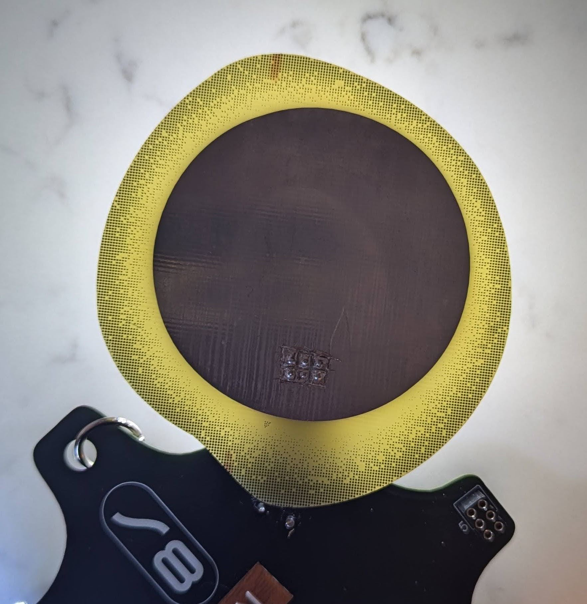

## Eclipse SAO

A quick and dirty SAO project for Hackaday Supercon 2024.

My first SAO, first attempt to do halftone on a PCB.

Due to timing, I was only able to do a single run of these before Supercon 2024, so it has flaws.

## WARNING

Due to the way this was designed, all the SAO connector pins are bridged by the front copper pour for the sun.  If you build one you will need to separate those pins manually, using a knife or similar.

## Lessons Learned

- Rather than directly importing the sun shape into the front copper layer, experiment with other ways of bringing this in to get the appropriate relief to the connector pins
- Consider / Experiment with covering the sun area with solder mask.
- LEDs were somewhat successful, but I ran out of time to experiment with diffusion techniques.  
- Experiment more with current draw and brightness levels.  I believe this was a significant drain on my badge's batteries.
- Form factor was slightly awkward.  Down-scaling by at least 20% would have made it easier to co-exist with other SAOs.  Not the only example of this, to be certain, but still worth considering.

Guesses as to what it was included:
- Sun, including one completely accurate guess of an eclipse
- Moon
- Fried egg
- Alvocado with a particularly large pit
- 
